# Bourse Engine

Bourse Engine is an in-memory Java trading and order-matching engine. It accepts buy and sell orders, maintains an independent limit order book for each symbol, and produces trades using strict **price-time priority**.

The engine supports:

- Limit and market orders
- Multiple trading symbols
- Best-bid and best-ask discovery
- FIFO execution within each price level
- Partial and complete fills
- Active-order cancellation
- Resting-price execution
- Exact integer arithmetic for prices and quantities
- In-memory trade history
- Synchronized engine operations for deterministic matching

> **Project scope:** Bourse Engine implements the core mechanics of an electronic exchange. It does not perform clearing, settlement, custody, market surveillance, regulatory reporting, or investment decision-making.

## Future Plan

| Phase                  | Planned Work                                                      | Goal                                                                                                                 |
| ---------------------- | ----------------------------------------------------------------- | -------------------------------------------------------------------------------------------------------------------- |
| 1. Service Layer       | Expose the Java matching engine through a REST API                | Allow external applications to submit orders, cancel orders, inspect order books, and retrieve generated trades      |
| 2. Next.js Frontend    | Build an interactive web interface connected to the API           | Let users create buy and sell orders, simulate market scenarios, inspect price levels, and observe matching behavior |
| 3. Deployment          | Containerize and host the backend and frontend                    | Make the simulator publicly accessible through a hosted web application                                              |
| 4. Simulation Features | Add predefined and custom trading scenarios                       | Help users explore partial fills, market orders, cancellations, multi-symbol books, and price-time priority          |
| 5. Persistence         | Add a database for orders, trades, simulations, and user sessions | Preserve historical data and support replay, analytics, and longer-running simulations                               |


## Table of contents

- [Project status](#project-status)
- [Quickstart](#quickstart)
- [Prerequisites](#prerequisites)
- [Repository layout](#repository-layout)
- [Core concepts](#core-concepts)
  - [Order](#order)
  - [Trade](#trade)
  - [How Order and Trade are connected](#how-order-and-trade-are-connected)
  - [Bid, ask, spread, and price level](#bid-ask-spread-and-price-level)
  - [Price-time priority](#price-time-priority)
- [Architecture](#architecture)
  - [High-level architecture](#high-level-architecture)
  - [Class relationships](#class-relationships)
  - [Component responsibilities](#component-responsibilities)
  - [Data structures](#data-structures)
- [Order submission and matching](#order-submission-and-matching)
  - [Submission flow](#submission-flow)
  - [Buy-order matching](#buy-order-matching)
  - [Sell-order matching](#sell-order-matching)
  - [Execution-price rule](#execution-price-rule)
  - [Partial fills](#partial-fills)
- [Order lifecycle](#order-lifecycle)
  - [Limit-order lifecycle](#limit-order-lifecycle)
  - [Market-order lifecycle](#market-order-lifecycle)
  - [Cancellation lifecycle](#cancellation-lifecycle)
- [Detailed component reference](#detailed-component-reference)
  - [`Order`](#order-class)
  - [`Trade`](#trade-class)
  - [`PriceLevel`](#pricelevel)
  - [`LimitOrderBook`](#limitorderbook)
  - [`MatchingEngine`](#matchingengine)
- [Complexity](#complexity)
- [Usage examples](#usage-examples)
- [Configuration and environment variables](#configuration-and-environment-variables)
- [Build and test](#build-and-test)
- [Expected outputs and generated files](#expected-outputs-and-generated-files)
---

## Project status

The current repository contains the core Java matching engine under `engine-java/`.

| Item | Value |
|---|---|
| Language | Java |
| Build system | Maven |
| Core module | `engine-java/` |
| Persistence | In-memory only |
| External database | None |
| External message broker | None |
| Network server | None in the core module |
| HTTP port | Not applicable |
| Authentication | Not applicable to the in-process core |
| Matching priority | Price, then FIFO arrival order |
| Price representation | Integer minor units or ticks |
| Quantity representation | Integer units |

---

## Quickstart

From the repository root:

```bash
git clone <repository-url> bourse-engine
cd bourse-engine/engine-java
mvn clean test
```

Expected final Maven result:

```text
[INFO] BUILD SUCCESS
```

The compiled classes are written to:

```text
engine-java/target/classes/
```

The packaged JAR is written to:

```text
engine-java/target/*.jar
```

> Replace `<repository-url>` with the actual Git repository URL. Do not commit credentials or access tokens into the URL.

---

## Prerequisites

Install the following tools before building the project:

| Requirement | Recommended version | Check command |
|---|---:|---|
| Java Development Kit | Java 17 or newer | `java -version` |
| Java compiler | Same JDK as the runtime | `javac -version` |
| Apache Maven | Maven 3.8 or newer | `mvn -version` |
| Git | Current stable version | `git --version` |

The Java and Maven versions used by the project should remain consistent with the compiler configuration in `engine-java/pom.xml`.

### Verify the environment

```bash
java -version
javac -version
mvn -version
git --version
```

Maven should report the same Java installation selected by `JAVA_HOME`.

---

## Repository layout

```text
BOURSE-ENGINE/
├── .claude/
│   └── settings.local.json
├── engine-java/
│   ├── .mvn/
│   ├── pom.xml
│   ├── src/
│   │   ├── main/
│   │   │   └── java/
│   │   │       └── com/
│   │   │           └── bourse/
│   │   │               ├── book/
│   │   │               │   ├── LimitOrderBook.java
│   │   │               │   └── PriceLevel.java
│   │   │               ├── engine/
│   │   │               │   └── MatchingEngine.java
│   │   │               ├── order/
│   │   │               │   ├── Order.java
│   │   │               │   ├── OrderStatus.java
│   │   │               │   ├── OrderType.java
│   │   │               │   └── Side.java
│   │   │               └── trade/
│   │   │                   └── Trade.java
│   │   └── test/
│   └── target/
├── web/
├── .gitignore
├── CHANGELOG.md
├── CLAUDE.md
├── COMMIT_CONVENTION.md
├── README.md
└── Summary.md
```

### Package structure

| Package | Responsibility |
|---|---|
| `com.bourse.order` | Order definitions, order direction, type, status, validation, and lifecycle state |
| `com.bourse.book` | Price levels, bid and ask organization, active-order lookup, and cancellation |
| `com.bourse.engine` | Order routing, matching, trade generation, and per-symbol book management |
| `com.bourse.trade` | Immutable execution records produced by successful matches |

---

## Core concepts

### Order

An `Order` is an instruction to buy or sell a quantity of one symbol.

A simplified order contains:

```text
Order
├── id
├── symbol
├── side
├── type
├── price
├── quantity
├── remainingQuantity
├── timestamp
└── status
```

The engine recognizes two sides:

```text
BUY  — demand for the instrument
SELL — supply of the instrument
```

It recognizes two order types:

```text
LIMIT  — execute only at the limit price or better
MARKET — execute immediately against the best available resting prices
```

#### Limit order meaning

A limit buy means:

```text
Buy at the specified price or lower.
```

A limit sell means:

```text
Sell at the specified price or higher.
```

#### Market order meaning

A market order has no limit price. In this implementation, a market order uses:

```text
price = 0
```

It executes against available opposite-side liquidity until either:

- The order is fully filled, or
- The opposite side of the book has no remaining executable orders.

A market-order remainder does not rest in the order book.

### Trade

A `Trade` represents a completed execution between one buy order and one sell order.

A simplified trade contains:

```text
Trade
├── id
├── symbol
├── buyOrderId
├── sellOrderId
├── price
├── quantity
└── timestamp
```

A trade is not another order. It is the execution event produced after two compatible orders interact.

Example:

```text
Resting sell order:
  ID       = SELL-1
  Symbol   = AAPL
  Price    = 10,000
  Quantity = 5

Incoming buy order:
  ID       = BUY-1
  Symbol   = AAPL
  Price    = market
  Quantity = 5

Generated trade:
  Buy order ID  = BUY-1
  Sell order ID = SELL-1
  Price         = 10,000
  Quantity      = 5
```

### How Order and Trade are connected

`Order` and `Trade` are connected through order IDs.

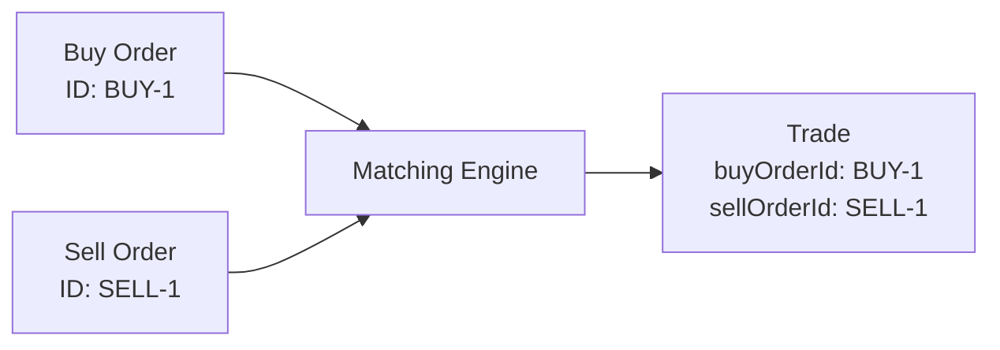

The `Trade` stores `buyOrderId` and `sellOrderId` rather than embedding complete `Order` objects.

This design is useful because:

1. An order exists before it has a counterparty.
2. One large order may execute against several smaller orders.
3. A single order can therefore appear in several trades.
4. The trade record only needs stable references to the participating orders.
5. The order remains responsible for its own quantity and lifecycle state.
6. The trade remains responsible for recording one execution event.

For example, one incoming buy order can create three trades:

```text
BUY-10 matches SELL-1 for 2 units
BUY-10 matches SELL-2 for 3 units
BUY-10 matches SELL-3 for 5 units
```

The same `BUY-10` ID appears in all three trade records. Storing a single `sellOrderId` inside the buy order would not represent this one-to-many relationship correctly.

### Why the classes expose getters

The fields are private to protect the object state. Getter methods provide controlled read access.

The engine uses getters to make matching decisions:

```java
order.getSide();
order.getType();
order.getPrice();
order.getRemainingQuantity();
```

The order book uses getters to place and remove orders:

```java
order.getId();
order.getSymbol();
order.getSide();
order.getPrice();
```

Tests and reporting code use getters to verify results:

```java
trade.getBuyOrderId();
trade.getSellOrderId();
trade.getPrice();
trade.getQuantity();
```

The number of methods reflects separation of responsibility and encapsulation. Callers can read valid state without directly modifying private fields.

### Why the Order constructor does not accept a timestamp

`Order` creates its timestamp internally:

```java
this.timestamp = Instant.now();
```

This gives every newly created order a creation time without requiring the caller to supply one. It also keeps timestamp creation consistent across all orders.

Similarly, `Trade` creates its timestamp when the execution record is constructed.

### Bid, ask, spread, and price level

A **bid** is a buy order. The **best bid** is the highest active buy price.

An **ask** is a sell order. The **best ask** is the lowest active sell price.

The **spread** is the difference between the best ask and best bid:

```text
spread = bestAsk - bestBid
```

A **price level** groups all active orders that share:

- The same symbol
- The same side
- The same price

Example:

```text
AAPL asks

Price 10,100
  SELL-4, quantity 3

Price 10,000
  SELL-1, quantity 5
  SELL-2, quantity 2
  SELL-3, quantity 7
```

`SELL-1`, `SELL-2`, and `SELL-3` belong to the same ask price level. Their execution order is FIFO.

### Price-time priority

Bourse Engine prioritizes orders in two stages.

#### 1. Price priority

For buys:

```text
Higher prices execute first.
```

For sells:

```text
Lower prices execute first.
```

#### 2. Time priority

Within the same price level:

```text
The oldest resting order executes first.
```

Example:

```text
ASK 10,000
  1. SELL-1, quantity 5
  2. SELL-2, quantity 4

Incoming market buy, quantity 7
```

Execution result:

```text
Trade 1: BUY-X with SELL-1, quantity 5, price 10,000
Trade 2: BUY-X with SELL-2, quantity 2, price 10,000
```

`SELL-2` remains at the head of the level with 2 units remaining.

---

## Architecture

### High-level architecture

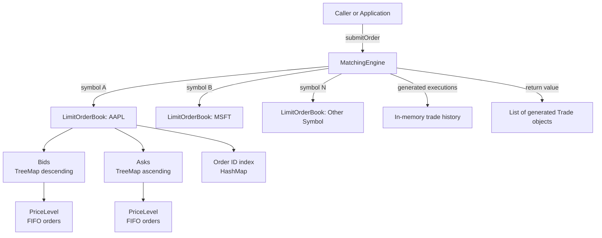

Each symbol has an independent order book:

```text
AAPL orders match only with AAPL orders.
MSFT orders match only with MSFT orders.
BTC-USD orders match only with BTC-USD orders.
```

### Class relationships

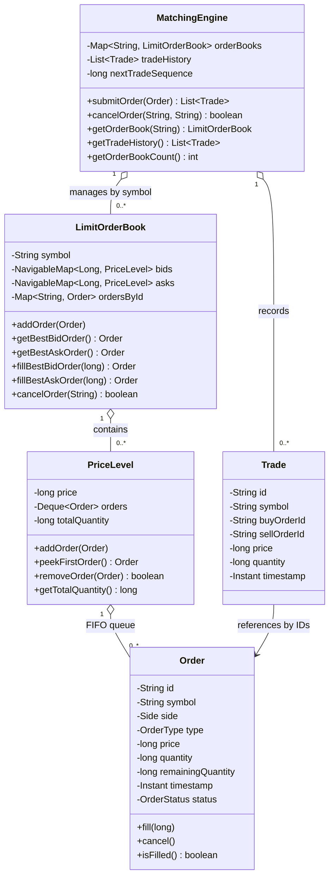

### Component responsibilities

| Component | Primary responsibility |
|---|---|
| `MatchingEngine` | Accept orders, select the correct symbol book, match orders, generate trades, and store trade history |
| `LimitOrderBook` | Maintain bid and ask price levels for one symbol and provide best-price access |
| `PriceLevel` | Maintain FIFO order priority and aggregate remaining quantity at one price |
| `Order` | Represent one buy or sell instruction and enforce valid lifecycle transitions |
| `Trade` | Represent one completed execution between a buyer and a seller |
| `Side` | Distinguish `BUY` from `SELL` |
| `OrderType` | Distinguish `LIMIT` from `MARKET` |
| `OrderStatus` | Track `NEW`, `PARTIALLY_FILLED`, `FILLED`, and `CANCELLED` states |

### Data structures

The order book combines several data structures because each solves a different problem.

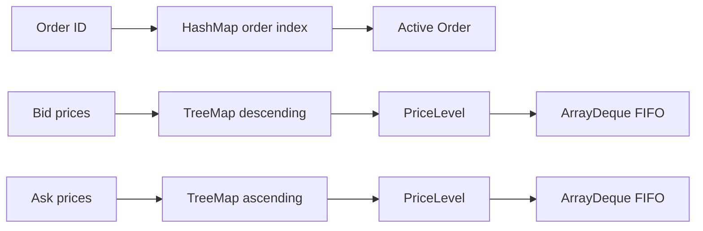

| Structure | Use |
|---|---|
| `HashMap<String, LimitOrderBook>` | Find a symbol's order book |
| Descending `TreeMap<Long, PriceLevel>` | Keep the highest bid first |
| Ascending `TreeMap<Long, PriceLevel>` | Keep the lowest ask first |
| `ArrayDeque<Order>` | Preserve FIFO order within a price level |
| `HashMap<String, Order>` | Locate active orders by ID for cancellation |
| `ArrayList<Trade>` | Preserve generated trades in engine sequence |

#### Bid ordering

```text
Highest price
    10,300  <- best bid
    10,200
    10,100
Lowest price
```

#### Ask ordering

```text
Lowest price
    10,400  <- best ask
    10,500
    10,600
Highest price
```

---

## Order submission and matching

### Submission flow

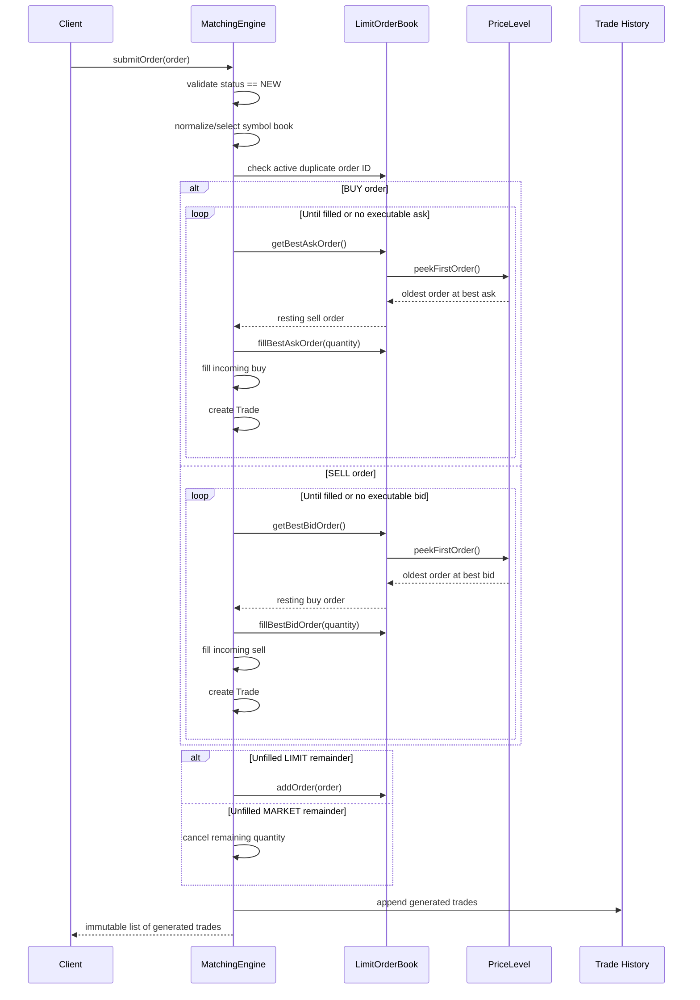

### Matching algorithm

Conceptually, the engine follows this process:

```text
1. Validate the incoming order.
2. Select or create the order book for the order's symbol.
3. Reject an active duplicate order ID in that book.
4. Select the opposite side:
   - BUY matches against asks.
   - SELL matches against bids.
5. Read the best opposite-side order.
6. Check whether the prices cross.
7. Execute the smaller of the two remaining quantities.
8. Update both orders.
9. Create a Trade at the resting order's price.
10. Remove fully filled resting orders.
11. Continue until the incoming order is filled or cannot match.
12. Rest an unfilled limit remainder.
13. Cancel an unfilled market remainder.
14. Append generated trades to history.
15. Return the trades created by this submission.
```

Pseudocode:

```text
submit(order):
    validate(order)
    book = orderBooks.getOrCreate(order.symbol)
    trades = []

    while order has remaining quantity:
        resting = book.bestOppositeOrder(order.side)

        if resting does not exist:
            break

        if limit prices do not cross:
            break

        executedQuantity = min(
            order.remainingQuantity,
            resting.remainingQuantity
        )

        fill(resting, executedQuantity)
        fill(order, executedQuantity)

        trade = createTrade(
            buyOrderId,
            sellOrderId,
            resting.price,
            executedQuantity
        )

        trades.add(trade)

    if order still has remaining quantity:
        if order is LIMIT:
            book.add(order)
        else:
            order.cancelRemaining()

    tradeHistory.addAll(trades)
    return trades
```

### Buy-order matching

An incoming buy order matches against the lowest available ask.

A limit buy is executable when:

```text
bestAsk <= buyLimitPrice
```

Example:

```text
Best ask:       10,000
Buy limit:      10,100
Result:         executable
Execution price: 10,000
```

A buy limit is not executable when:

```text
best ask:  10,200
buy limit: 10,100
```

In that case, the remaining buy quantity rests in the bid book at 10,100.

### Sell-order matching

An incoming sell order matches against the highest available bid.

A limit sell is executable when:

```text
bestBid >= sellLimitPrice
```

Example:

```text
Best bid:        10,500
Sell limit:      10,400
Result:          executable
Execution price: 10,500
```

A sell limit is not executable when:

```text
best bid:   10,300
sell limit: 10,400
```

In that case, the remaining sell quantity rests in the ask book at 10,400.

### Execution-price rule

Trades execute at the **resting order's price**.

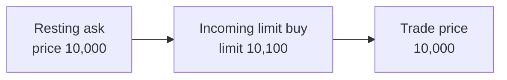

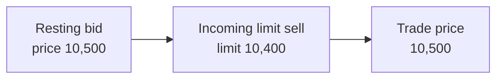

This means an aggressive incoming limit order can receive price improvement.

### Partial fills

The executed quantity is:

```text
min(incoming.remainingQuantity, resting.remainingQuantity)
```

#### Incoming order is smaller

```text
Resting sell: 10 units
Incoming buy: 4 units
```

Result:

```text
Trade quantity:          4
Incoming buy remaining:  0
Resting sell remaining:  6
```

The resting order remains at the front of its price level.

#### Incoming order is larger

```text
Resting sell: 4 units
Incoming buy: 10 units
```

Result after the first match:

```text
Trade quantity:          4
Resting sell remaining:  0
Incoming buy remaining:  6
```

The engine removes the filled sell order and continues with the next best ask.

---

## Order lifecycle

### State model

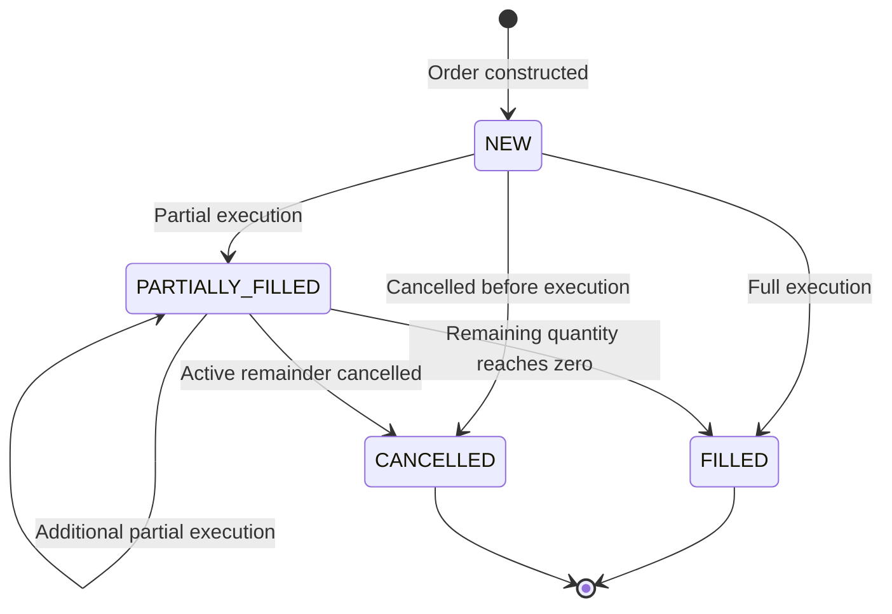

### Limit-order lifecycle

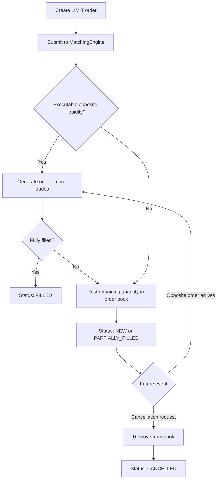

A limit order can:

- Fill immediately in full
- Fill immediately in part and rest the remainder
- Not fill immediately and rest in full
- Fill later when an opposite order arrives
- Be cancelled while still active

### Market-order lifecycle

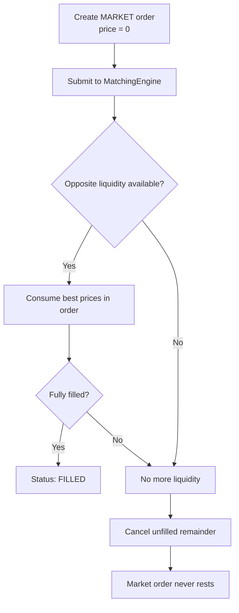

A market order can:

- Fill at one price level
- Sweep several price levels
- Fill partially and cancel its remainder
- Find no liquidity and be cancelled without a trade

### Cancellation lifecycle

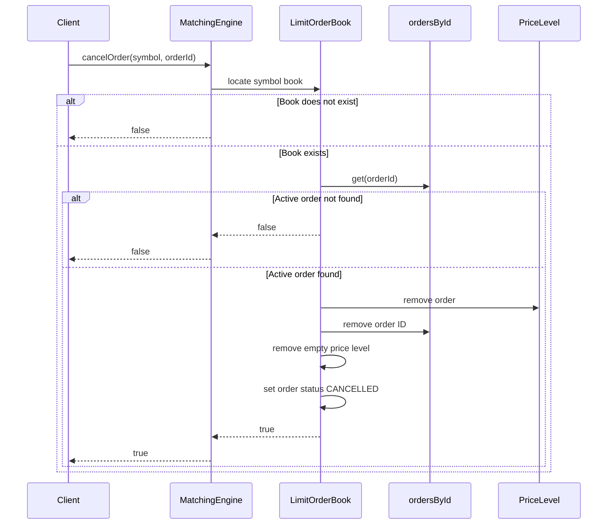

---

## Detailed component reference

<a id="order-class"></a>
### `Order`

Source:

```text
engine-java/src/main/java/com/bourse/order/Order.java
```

`Order` models one buy or sell instruction.

#### Fields

| Field | Type | Meaning |
|---|---|---|
| `id` | `String` | Caller-supplied order identifier |
| `symbol` | `String` | Normalized instrument symbol |
| `side` | `Side` | `BUY` or `SELL` |
| `type` | `OrderType` | `LIMIT` or `MARKET` |
| `price` | `long` | Limit price in integer minor units; zero for market orders |
| `quantity` | `long` | Original requested quantity |
| `remainingQuantity` | `long` | Unexecuted quantity |
| `timestamp` | `Instant` | Object creation time |
| `status` | `OrderStatus` | Current lifecycle state |

#### Constructor validation

The constructor rejects:

- Null or blank order IDs
- Null or blank symbols
- Null sides
- Null order types
- Zero or negative quantities
- Limit orders with zero or negative prices
- Market orders with a nonzero price

Symbols are normalized using:

```text
trim + uppercase
```

Example:

```text
" aapl " -> "AAPL"
```

#### Lifecycle methods

| Method | Purpose |
|---|---|
| `fill(long fillQuantity)` | Reduce remaining quantity and update status |
| `cancel()` | Mark an active order as cancelled |
| `isFilled()` | Return whether the order is fully filled |

`fill()` enforces that:

- Fill quantity is positive
- Cancelled orders cannot be filled
- Filled orders cannot be filled again
- Fill quantity cannot exceed remaining quantity

Status update rule:

```text
remainingQuantity == 0 -> FILLED
remainingQuantity > 0  -> PARTIALLY_FILLED
```

#### Getter methods

| Getter | Used for |
|---|---|
| `getId()` | Active-order indexing, cancellation, and trade references |
| `getSymbol()` | Routing to the correct order book |
| `getSide()` | Selecting the opposite side for matching |
| `getType()` | Applying limit or market behavior |
| `getPrice()` | Price crossing and price-level placement |
| `getQuantity()` | Original order reporting |
| `getRemainingQuantity()` | Fill calculation and aggregate quantity |
| `getTimestamp()` | Auditing and inspection |
| `getStatus()` | Submission validation and lifecycle checks |

<a id="trade-class"></a>
### `Trade`

Source:

```text
engine-java/src/main/java/com/bourse/trade/Trade.java
```

`Trade` is an immutable execution record.

#### Fields

| Field | Type | Meaning |
|---|---|---|
| `id` | `String` | Engine-generated trade identifier such as `TRD-1` |
| `symbol` | `String` | Instrument that was traded |
| `buyOrderId` | `String` | ID of the participating buy order |
| `sellOrderId` | `String` | ID of the participating sell order |
| `price` | `long` | Execution price |
| `quantity` | `long` | Executed quantity |
| `timestamp` | `Instant` | Time the trade object was created |

#### Constructor validation

The constructor rejects:

- Null or blank trade IDs
- Null or blank symbols
- Null or blank buy order IDs
- Null or blank sell order IDs
- Zero or negative prices
- Zero or negative quantities
- Identical buy and sell order IDs

#### Trade identity

`MatchingEngine` generates trade IDs in sequence:

```text
TRD-1
TRD-2
TRD-3
...
```

A trade ID identifies an execution. An order ID identifies an instruction. They are different namespaces and represent different domain objects.

<a id="pricelevel"></a>
### `PriceLevel`

Source:

```text
engine-java/src/main/java/com/bourse/book/PriceLevel.java
```

`PriceLevel` groups active limit orders at one price and preserves FIFO priority.

```text
PriceLevel 10,000
├── head -> ORDER-1
├──         ORDER-2
├── tail -> ORDER-3
└── totalQuantity = sum of remaining quantities
```

#### Responsibilities

- Validate that added orders are limit orders
- Validate that order prices match the level price
- Add new orders at the tail
- Return the oldest order from the head
- Apply fills to the head order
- Remove cancelled or completed orders
- Maintain aggregate remaining quantity
- Report order count and level state

#### Important methods

| Method | Purpose |
|---|---|
| `addOrder(Order)` | Append an order to the FIFO tail |
| `peekFirstOrder()` | Read the oldest order without removing it |
| `fillFirstOrder(long)` | Fill the oldest order and update total quantity |
| `removeOrder(Order)` | Remove an order and update aggregate quantity |
| `getTotalQuantity()` | Return total remaining quantity at the price |
| `getOrderCount()` | Return the number of active orders at the price |
| `getOrders()` | Return an immutable snapshot list of orders |

<a id="limitorderbook"></a>
### `LimitOrderBook`

Source:

```text
engine-java/src/main/java/com/bourse/book/LimitOrderBook.java
```

A `LimitOrderBook` manages all resting limit orders for one symbol.

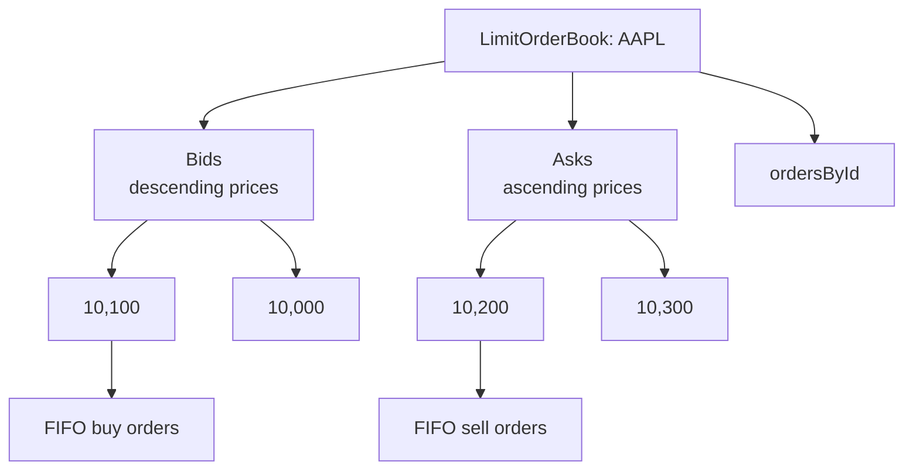

#### Responsibilities

- Maintain bid levels from highest to lowest
- Maintain ask levels from lowest to highest
- Add resting limit orders
- Return the best bid or ask order
- Fill the best bid or ask order
- Remove filled orders
- Cancel active orders by ID
- Remove empty price levels
- Maintain an active-order lookup map

#### Important methods

| Method | Purpose |
|---|---|
| `addOrder(Order)` | Add an active limit order to the correct side and level |
| `getOrder(String)` | Retrieve an active order by ID |
| `containsOrder(String)` | Check for an active duplicate ID |
| `getBestBidOrder()` | Return the oldest order at the highest bid |
| `getBestAskOrder()` | Return the oldest order at the lowest ask |
| `getBestBidPrice()` | Return the highest bid price |
| `getBestAskPrice()` | Return the lowest ask price |
| `fillBestBidOrder(long)` | Fill the oldest order at the best bid |
| `fillBestAskOrder(long)` | Fill the oldest order at the best ask |
| `cancelOrder(String)` | Cancel and remove an active order |
| `getOrderCount()` | Return active orders in the book |
| `getBidLevelCount()` | Return active bid price levels |
| `getAskLevelCount()` | Return active ask price levels |
| `isEmpty()` | Return whether the book has no active orders |

<a id="matchingengine"></a>
### `MatchingEngine`

Source:

```text
engine-java/src/main/java/com/bourse/engine/MatchingEngine.java
```

`MatchingEngine` is the orchestration layer.

#### Internal state

```text
orderBooks
  AAPL -> LimitOrderBook
  MSFT -> LimitOrderBook
  TSLA -> LimitOrderBook

tradeHistory
  TRD-1
  TRD-2
  TRD-3

nextTradeSequence
  4
```

#### Responsibilities

- Validate order submission state
- Normalize symbols
- Create symbol books on first use
- Prevent active duplicate order IDs within a book
- Route buy orders to ask matching
- Route sell orders to bid matching
- Generate trade IDs
- Append trades to history
- Rest unmatched limit quantities
- Cancel unmatched market quantities
- Expose cancellation and inspection operations

#### Public methods

| Method | Result |
|---|---|
| `submitOrder(Order)` | Immutable list of trades generated by this submission |
| `cancelOrder(String symbol, String orderId)` | `true` if cancelled; otherwise `false` |
| `getOrderBook(String symbol)` | The symbol's book, or `null` if one has not been created |
| `getTradeHistory()` | Immutable copy of all generated trades |
| `getOrderBookCount()` | Number of symbol books currently managed |

#### Threading model

Public engine operations are synchronized. A single `MatchingEngine` instance serializes order submission, cancellation, and inspection calls. This preserves deterministic mutation order for the in-memory engine.

---

## Complexity

Let:

```text
P = number of active price levels in a symbol book
Q = number of orders at one price level
K = number of resting orders consumed by an incoming order
N = total active orders
```

The documented design targets the following behavior:

| Operation | Expected complexity |
|---|---:|
| Find symbol order book | O(1) average |
| Find active order by ID | O(1) average |
| Add or locate a price level | O(log P) |
| Read best bid or ask | O(log P) map access, with the best entry directly available |
| Append at a price level | O(1) |
| Read oldest order at a level | O(1) |
| Apply a head-order fill | O(1) |
| Cancel an indexed active order | O(1) expected lookup and removal path |
| Match against `K` resting orders | O(K log P) in the general case |
| Memory | O(N + P) |

The important performance properties are:

- Prices remain ordered without scanning all orders.
- FIFO priority is maintained independently at each price.
- Active orders are directly addressable by ID.
- Aggregate quantity is updated incrementally.
- Empty levels are removed when their final order leaves.

---

## Usage examples

### Minimal Java example

Create a file named `BourseExample.java` inside `engine-java/`:

```java
import com.bourse.engine.MatchingEngine;
import com.bourse.order.Order;
import com.bourse.order.OrderType;
import com.bourse.order.Side;
import com.bourse.trade.Trade;

import java.util.List;

public final class BourseExample {
    public static void main(String[] args) {
        MatchingEngine engine = new MatchingEngine();

        Order restingSell = new Order(
                "SELL-1",
                "AAPL",
                Side.SELL,
                OrderType.LIMIT,
                10_000,
                5
        );

        Order incomingBuy = new Order(
                "BUY-1",
                "AAPL",
                Side.BUY,
                OrderType.MARKET,
                0,
                5
        );

        engine.submitOrder(restingSell);
        List<Trade> trades = engine.submitOrder(incomingBuy);

        trades.forEach(System.out::println);
    }
}
```

Build the engine and run the example:

```bash
mvn -q -DskipTests package
javac -cp target/classes BourseExample.java
java -cp target/classes:. BourseExample
```

On Windows Command Prompt, use `;` instead of `:` in the runtime classpath:

```bat
java -cp target/classes;. BourseExample
```

Expected output structure:

```text
Trade{id='TRD-1', symbol='AAPL', buyOrderId='BUY-1', sellOrderId='SELL-1', price=10000, quantity=5, timestamp=<generated timestamp>}
```

Remove the example artifacts afterward:

```bash
rm -f BourseExample.java BourseExample.class
```

### Limit buy that receives price improvement

```java
MatchingEngine engine = new MatchingEngine();

engine.submitOrder(new Order(
        "SELL-1", "AAPL", Side.SELL,
        OrderType.LIMIT, 10_000, 5
));

List<Trade> trades = engine.submitOrder(new Order(
        "BUY-1", "AAPL", Side.BUY,
        OrderType.LIMIT, 10_100, 5
));
```

Result:

```text
The buy limit allows a price up to 10,100.
The resting ask is 10,000.
The order executes at 10,000.
```

### Partial fill across multiple orders

Initial book:

```text
ASK 10,000
  SELL-1: 3
  SELL-2: 4

ASK 10,100
  SELL-3: 10
```

Incoming order:

```text
BUY-1: market buy quantity 9
```

Generated executions:

```text
TRD-1: BUY-1 x SELL-1, 3 at 10,000
TRD-2: BUY-1 x SELL-2, 4 at 10,000
TRD-3: BUY-1 x SELL-3, 2 at 10,100
```

Remaining book:

```text
ASK 10,100
  SELL-3: 8
```

### Cancellation

```java
MatchingEngine engine = new MatchingEngine();

engine.submitOrder(new Order(
        "BUY-1", "AAPL", Side.BUY,
        OrderType.LIMIT, 9_900, 10
));

boolean cancelled = engine.cancelOrder("AAPL", "BUY-1");
System.out.println(cancelled);
```

Expected output:

```text
true
```

Calling cancellation again returns:

```text
false
```

### Multiple symbols

```java
MatchingEngine engine = new MatchingEngine();

engine.submitOrder(new Order(
        "AAPL-BUY-1", "AAPL", Side.BUY,
        OrderType.LIMIT, 10_000, 5
));

engine.submitOrder(new Order(
        "MSFT-SELL-1", "MSFT", Side.SELL,
        OrderType.LIMIT, 20_000, 5
));
```

These orders do not match because they belong to different symbol books.

---

## Configuration and environment variables

### Required application environment variables

None.

The core engine:

- Does not read credentials
- Does not call external services
- Does not connect to a database
- Does not open a network port
- Does not require a configuration file at runtime

### Optional standard Java and Maven variables

| Variable | Required | Purpose | Example |
|---|---|---|---|
| `JAVA_HOME` | Usually | Select the JDK used by Maven | `/usr/lib/jvm/java-17-openjdk` |
| `MAVEN_OPTS` | No | Configure Maven JVM memory or diagnostics | `-Xms256m -Xmx1g` |
| `JAVA_TOOL_OPTIONS` | No | Apply JVM options to Java processes | `-XX:+HeapDumpOnOutOfMemoryError` |

Example for Unix-like systems:

```bash
export JAVA_HOME=/path/to/jdk-17
export MAVEN_OPTS="-Xms256m -Xmx1g"
mvn clean test
```

Example for Windows PowerShell:

```powershell
$env:JAVA_HOME = "C:\Path\To\jdk-17"
$env:MAVEN_OPTS = "-Xms256m -Xmx1g"
mvn clean test
```

Do not store secrets in these variables for this project because the engine does not require secrets.

---

## Build and test

Run all commands from:

```text
BOURSE-ENGINE/engine-java/
```

### Compile

```bash
mvn clean compile
```

Expected result:

```text
[INFO] BUILD SUCCESS
```

Compiled classes:

```text
target/classes/
```

### Run tests

```bash
mvn clean test
```

Expected result:

```text
[INFO] BUILD SUCCESS
```

Test reports:

```text
target/surefire-reports/
```

The exact number of tests depends on the current test suite.

### Package

```bash
mvn clean package
```

Expected result:

```text
[INFO] BUILD SUCCESS
```

Packaged artifact:

```text
target/*.jar
```

### Skip tests for a local package build

```bash
mvn clean package -DskipTests
```

Use this only when tests have already passed or when diagnosing a build-stage issue.

### Recommended matching tests

The test suite should cover at least:

- Highest bid is selected first
- Lowest ask is selected first
- FIFO within one price level
- Full fills
- Partial incoming fills
- Partial resting fills
- Matching across several price levels
- Resting-price execution
- Non-crossing limit orders
- Market-order remainder cancellation
- Limit-order remainder insertion
- Active cancellation
- Duplicate active order IDs
- Symbol normalization
- Independent books per symbol
- Invalid prices and quantities
- Invalid lifecycle transitions
- Trade-history ordering

### Useful test structure

```text
src/test/java/com/bourse/
├── book/
│   ├── LimitOrderBookTest.java
│   └── PriceLevelTest.java
├── engine/
│   └── MatchingEngineTest.java
├── order/
│   └── OrderTest.java
└── trade/
    └── TradeTest.java
```

### Invariant checks

After any sequence of submissions and cancellations, tests should verify:

```text
1. Every active order belongs to exactly one price level.
2. Every active order is present in the ID lookup.
3. No filled order remains in the active book.
4. No cancelled order remains in the active book.
5. Price-level total quantity equals the sum of remaining quantities.
6. Bid prices remain ordered from highest to lowest.
7. Ask prices remain ordered from lowest to highest.
8. FIFO order is preserved at equal prices.
9. Trade quantity is always positive.
10. Trade price is always positive.
```

---

## Expected outputs and generated files

| Action | Expected output or location |
|---|---|
| Compile | `engine-java/target/classes/` |
| Run tests | Maven `BUILD SUCCESS`; reports under `target/surefire-reports/` |
| Package | JAR under `engine-java/target/` |
| Submit a non-crossing limit order | Empty returned trade list; order rests in its symbol book |
| Submit a fully matched order | One or more returned `Trade` objects |
| Submit a market order with insufficient liquidity | Trades for available quantity; remainder cancelled |
| Cancel an active order | `true` |
| Cancel an unknown or completed order | `false` |
| Query an unknown symbol book | `null` |
| Trade history | Available in memory through `getTradeHistory()` |

The core engine does not write order or trade records to disk. Restarting the JVM clears all in-memory books and history.
